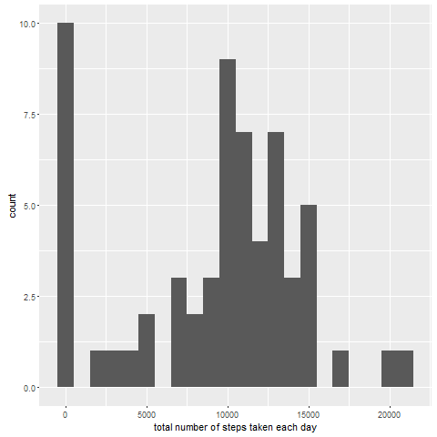
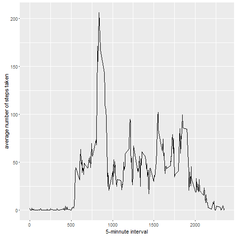
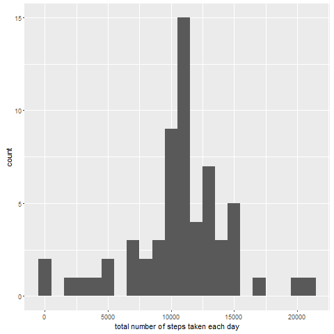
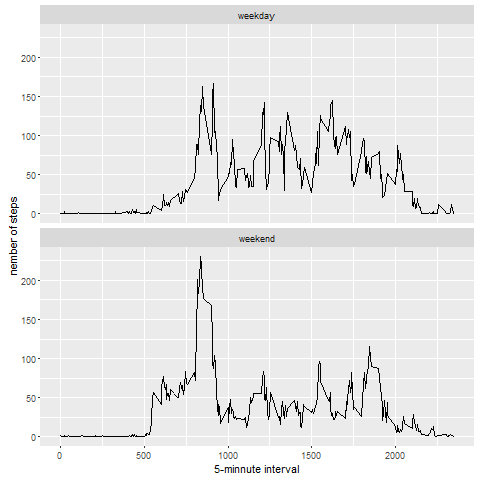

# Assessement for the course Reproductible Research 

It is now possible to collect a large amount of data about personal movement using activity monitoring devices such as a   Fitbit, Nike Fuelband, or Jawbone Up. These type of devices are part of the "quantified self" movement - a group of   enthusiasts who take measurements about themselves regularly to improve their health, to find patterns in their behavior, or   because they are tech geeks. But these data remain under-utilized both because the raw data are hard to obtain and there   is a lack of statistical methods and software for processing and interpreting the data.  
  
This assignment makes use of data from a personal activity monitoring device. This device collects data at 5 minute   intervals through out the day. The data consists of two months of data from an anonymous individual collected during the   months of October and November, 2012 and include the number of steps taken in 5 minute intervals each day.  
  
The data for this assignment can be downloaded from the course web site:  
  
Dataset: Activity monitoring data [52K]  
The variables included in this dataset are:  
  
- steps: Number of steps taking in a 5-minute interval (missing values are coded as NA)  
- date: The date on which the measurement was taken in YYYY-MM-DD format  
- interval: Identifier for the 5-minute interval in which measurement was taken  

The dataset is stored in a comma-separated-value (CSV) file and there are a total of 17,568 observations in this dataset.      
  
We suppose that the data activity.csv are in the working directory

###Loading required libraries
Here, we load the required packages

```r
if (!require("data.table")) {
  install.packages("data.table")
}
require("data.table")

if (!require("ggplot2")) {
  install.packages("ggplot2")
}
require("ggplot2")
```
###Loading and preprocessing the data
Here, we load and process the date. We format the data column with as.Date.

```r
Activity <- fread(input=,"activity.csv",
                  header=TRUE,
                  sep=",",
                  na.strings = "NA",
                  colClasses = c("numeric","character","numeric"))
Activity[,":=" (date=as.Date(date, format="%Y-%m-%d"))]
```
###What is mean total number of steps taken per day?
Here, we are going to calculate the total number of steps taken per day and to report the mean and median of the  
total number of steps taken per day. The missing values in the dataset are ignored.

```r
TotalStepPerDay <- Activity[,.(dailysteps=sum(steps, na.rm=TRUE)),by=.(date)]
p <- ggplot(data=TotalStepPerDay, aes(x=dailysteps))+
  geom_histogram(binwidth = 1000)+
  labs(x = "total number of steps taken each day")
print(p)
```



```r
MeanStep <- round(mean(TotalStepPerDay$dailysteps),0)
MedianStep <-round(median(TotalStepPerDay$dailysteps),0)
```
The mean and median of the total number of steps taken per day are respectively **9354** and **1.0395 &times; 10<sup>4</sup>**

###What is the average daily activity pattern?
Here, we are going to make a plot of the 5-min interval and the average number of steps taken, averaged across all days.

```r
MeanStepPerDay <- Activity[,.(meansteps=mean(steps, na.rm=TRUE)),by=.(interval)]

p <- ggplot(data=MeanStepPerDay, aes(x=interval, y=meansteps))+
  geom_line()+
  labs(x = "5-minute interval", y="average number of steps taken")
print(p)
```



```r
IntervalMaxStep <- MeanStepPerDay$interval[which.max(MeanStepPerDay$meansteps)]
```
On average across all the days, the 5-min interval which contains the maximum number of steps is **835**  

###Imputing missing values
There are a number of days/intervals where there are missing values (coded as NA). The presence of missing days may introduce bias into some calculations or summaries of the data.
Here, we are going to calculate the total number of missing values in the dataset and devise a strategy for filling in all the missing value. for that, we will calculate the mean of steps for each 5-min. So if one day there is a NA for interval 20, we will replace it by the mean of this interval across all days.  

```r
missing <- is.na(Activity$steps)
table(missing)
```

```
## missing
## FALSE  TRUE 
## 15264  2304
```

```r
NumberNA <- sum(!complete.cases(Activity$steps))
PercentageNA <- round(NumberNA/length(Activity$steps)*100,0)
```
There are around **2304** missing values (**13**%)  
    
Now we will replace NA of an interval by the mean of this interval across all days


```r
setkey(MeanStepPerDay,interval)
setkey(Activity,interval)
DataResult <- MeanStepPerDay[Activity]
ActivityWithoutNA <- DataResult[,":=" (steps=ifelse(is.na(steps),meansteps,steps))]
ActivityWithoutNA[, c("meansteps"):=NULL]
Activity[,c("date","interval","steps"),with=FALSE]
```

```
##              date interval steps
##     1: 2012-10-01        0    NA
##     2: 2012-10-02        0     0
##     3: 2012-10-03        0     0
##     4: 2012-10-04        0    47
##     5: 2012-10-05        0     0
##    ---                          
## 17564: 2012-11-26     2355     0
## 17565: 2012-11-27     2355     0
## 17566: 2012-11-28     2355     0
## 17567: 2012-11-29     2355     0
## 17568: 2012-11-30     2355    NA
```

```r
ActivityWithoutNA[,c("date","interval","steps"),with=FALSE]
```

```
##              date interval     steps
##     1: 2012-10-01        0  1.716981
##     2: 2012-10-02        0  0.000000
##     3: 2012-10-03        0  0.000000
##     4: 2012-10-04        0 47.000000
##     5: 2012-10-05        0  0.000000
##    ---                              
## 17564: 2012-11-26     2355  0.000000
## 17565: 2012-11-27     2355  0.000000
## 17566: 2012-11-28     2355  0.000000
## 17567: 2012-11-29     2355  0.000000
## 17568: 2012-11-30     2355  1.075472
```
The new dataset is equal to the original dataset but with the missing data filled in.


```r
missing <- is.na(ActivityWithoutNA$steps)
table(missing)
```

```
## missing
## FALSE 
## 17568
```

```r
NumberNA <- sum(!complete.cases(ActivityWithoutNA$steps))
PercentageNA <- round(NumberNA/length(ActivityWithoutNA$steps)*100,0)
```
There are now around **0** missing values (**0**%)  
We will make a histogram of the total number of steps taken each day.

```r
TotalStepPerDayWithoutNA <- ActivityWithoutNA[,.(dailysteps=sum(steps, na.rm=TRUE)),by=.(date)]
p <- ggplot(data=TotalStepPerDayWithoutNA, aes(x=dailysteps))+
  geom_histogram(binwidth = 1000)+
  labs(x = "total number of steps taken each day")
print(p)
```



```r
MeanStep <- mean(TotalStepPerDayWithoutNA$dailysteps)
MedianStep <- median(TotalStepPerDayWithoutNA$dailysteps)
```
Now, the mean and median of the total number of steps taken per day are respectively **1.0766189 &times; 10<sup>4</sup>** and **1.0766189 &times; 10<sup>4</sup>**  
Mean and median values are higher after imputing missing data.

##Are there differences in activity patterns between weekdays and weekends?
Here, we are going to make a plot containing a time series plot of the 5-min interval and the average of steps taken, averaged across all weekday days or weekend days.

We will create a new factor variable in the dataset with two levels - "weekday" and "weekend" indicating whether a given date is a weekday or weekend day.

```r
ActivityWithoutNA[,":=" (weekdayi=weekdays(date))]
weekend <- c("samedi","dimanche")
ActivityWithoutNA[,":=" (weekday_variable=factor((weekdayi %in% weekend), levels=c(TRUE,FALSE),labels=c("weekday","weekend")))]
ActivityWithoutNA[,c("weekdayi"):=NULL]
ActivityWithoutNA
```

```
##        interval     steps       date weekday_variable
##     1:        0  1.716981 2012-10-01          weekend
##     2:        0  0.000000 2012-10-02          weekend
##     3:        0  0.000000 2012-10-03          weekend
##     4:        0 47.000000 2012-10-04          weekend
##     5:        0  0.000000 2012-10-05          weekend
##    ---                                               
## 17564:     2355  0.000000 2012-11-26          weekend
## 17565:     2355  0.000000 2012-11-27          weekend
## 17566:     2355  0.000000 2012-11-28          weekend
## 17567:     2355  0.000000 2012-11-29          weekend
## 17568:     2355  1.075472 2012-11-30          weekend
```

```r
MeanStepPerDayWeekday <- ActivityWithoutNA[,.(meansteps=mean(steps, na.rm=TRUE)),by=.(interval, weekday_variable)]

p <- ggplot(data=MeanStepPerDayWeekday, aes(x=interval, y=meansteps))+
  geom_line()+
  labs(x = "5-minnute interval", y="nember of steps")+
  facet_wrap(~weekday_variable, ncol=1)
print(p)
```



